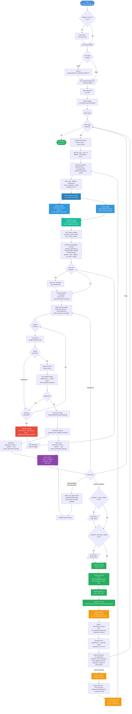

# skejl — system flow

Paste the Mermaid block below into https://mermaid.live to preview,
or use the "Mermaid to Figma" plugin in Figma/FigJam to import.

```mermaid
flowchart TD
    START([Start\nchainlit run ui/app.py])

    %% ── SETUP ───────────────────────────────────────────
    START --> APICHECK{GEMINI_API_KEY\nin .env?}
    APICHECK -- No --> ENTERKEY[User enters\nAPI key in chat]
    ENTERKEY --> BRAND
    APICHECK -- Yes --> BRAND

    BRAND[/Ask: brand identity/]
    BRAND --> BRANDINPUT{User types\nor skips?}
    BRANDINPUT -- Types --> SAVEBRAND[Save to\nsettings.DEFAULT_BRAND_IDENTITY]
    BRANDINPUT -- Skips --> UPLOAD
    SAVEBRAND --> UPLOAD

    %% ── UPLOAD ──────────────────────────────────────────
    UPLOAD[/Ask: upload products.json\n+ product images/]
    UPLOAD --> FILES[User drags files\ninto chat]
    FILES --> MATCH[Match images\nto products.json by filename]
    MATCH --> QUEUE[(Image queue)]

    %% ── PIPELINE LOOP ───────────────────────────────────
    QUEUE --> NEXT{Next image\nin queue?}
    NEXT -- No --> DONE([All products\nprocessed ✓])
    NEXT -- Yes --> FEATURES

    %% ── FEATURE EXTRACTION ──────────────────────────────
    FEATURES["[1/5] Extract features\nGemini Vision → vision_tool.py"]
    FEATURES --> FEAT_OUT["garment_type · color · fit\ngender · composition · art_nr"]

    %% ── ML PREDICTION ───────────────────────────────────
    FEAT_OUT --> ML["[2/5] ML prediction\nRandomForest → ml_predictor.py\n28 800 combinations scored"]
    ML --> ML_OUT["Best: style · lighting · background\npose · expression · angle\nPredicted CTR %"]

    %% ── AGENT DEBATE ────────────────────────────────────
    ML_OUT --> DEBATE["[3/5] Multi-agent debate\n_run_debate_streaming()"]
    DEBATE --> OPT["Optimizer agent\nConversion-focused argument\nbuild_optimizer_prompt()"]
    DEBATE --> CREAT["Creative agent\nBrand-aligned argument\nbuild_creative_prompt()"]
    OPT --> MOD
    CREAT --> MOD
    MOD["Moderator agent\nConsensus decision\nbuild_moderator_prompt()"]
    MOD --> CONSENSUS["final_image_settings\nconsensus_type: hybrid / full_ml / full_creative"]

    %% ── SCENARIO + DESCRIPTION ──────────────────────────
    CONSENSUS --> SCENARIO["Generate photography scenario\nscenario_generator.py\n+ MANDATORY SCENE CONSTRAINTS\n(gender · style · lighting · bg · pose · angle)"]
    SCENARIO --> USERHINT{user_hint\npresent?}
    USERHINT -- Yes --> INJECT["Inject user_guidance\ninto scenario dict"]
    USERHINT -- No --> DESC
    INJECT --> DESC

    DESC["Generate product description\nGemini Text → build_description_prompt()"]

    %% ── IMAGE GENERATION ────────────────────────────────
    DESC --> GENLOOP["[4/5] Generate image\nimage_gen_tool.py → nano-banana-pro\nbuild_image_gen_prompt()"]

    GENLOOP --> ATTEMPT{Attempt\n1 / MAX=2}
    ATTEMPT --> GENAPI[Call Gemini\nImage Generation API]
    GENAPI --> BLOCKED{Image\nreturned?}
    BLOCKED -- No/Blocked --> RETRY{Attempts\nexhausted?}
    RETRY -- No --> ATTEMPT
    RETRY -- Yes --> FAILSTATE["Generation failed\nShow: Retry + Skip buttons\nstate = awaiting_generation_feedback"]
    FAILSTATE --> USERFEEDBACK[/User describes\nwhat to change/]
    USERFEEDBACK --> USERHINT

    BLOCKED -- Yes --> CROP["Crop to 4:5 ratio\nimage_utils.py"]

    %% ── VALIDATION ──────────────────────────────────────
    CROP --> VALIDATE["[5/5] Validate image\nvalidation.py → Gemini Vision\nbuild_validation_prompt()"]
    VALIDATE --> VALID{Approved?}
    VALID -- No --> RETRY
    VALID -- Yes --> SAVEMAIN["Save main image\ndata/output/{stem}_generated.jpg"]

    %% ── VARIANTS ────────────────────────────────────────
    SAVEMAIN --> VARIANTS["Generate variants\n_generate_and_validate_variants()"]
    VARIANTS --> SIDE["Side view\ngenerate_variant() → validate → save\n{stem}_generated_side.jpg"]
    VARIANTS --> BACK["Back view\ngenerate_variant() → validate → save\n{stem}_generated_back.jpg"]

    %% ── REVIEW ──────────────────────────────────────────
    SIDE --> REVIEW
    BACK --> REVIEW
    REVIEW["Show results\nstate = reviewing\n3 images + title + description"]

    REVIEW --> CHOICE{User action}
    CHOICE -- "Types feedback\ne.g. 'more urban'" --> REFINE["refine_and_regenerate()\nEdit generated image\ndirect Gemini call with feedback"]
    REFINE --> VALIDATE2["Validate refined image"]
    VALIDATE2 --> REVIEW

    CHOICE -- Regenerate --> GENLOOP
    CHOICE -- Skip → --> NEXT

    %% ── PUBLISH ─────────────────────────────────────────
    CHOICE -- "Publish / publicera" --> SHOPCHECK{SHOPIFY_SHOP_NAME\nin env?}
    SHOPCHECK -- No --> ASKSHOP[/User enters\nshop name/]
    ASKSHOP --> TOKENCHECK
    SHOPCHECK -- Yes --> TOKENCHECK

    TOKENCHECK{SHOPIFY_ACCESS_TOKEN\nin env?}
    TOKENCHECK -- No --> ASKTOKEN[/User enters\naccess token/]
    ASKTOKEN --> DOPUBLISH
    TOKENCHECK -- Yes --> DOPUBLISH

    DOPUBLISH["Upload to Shopify\nshopify_tool.py"]
    DOPUBLISH --> CREATEPROD["create_product()\nPOST /admin/api/products.json\ntitle · description · SKU · tags"]
    CREATEPROD --> UPLOADIMGS["upload_image() × 3\nmain · side · back"]
    UPLOADIMGS --> PRODID["Product ID + URL\nhttps://{shop}.myshopify.com/admin/products/{id}"]

    %% ── FEEDBACK LOOP ───────────────────────────────────
    PRODID --> FEEDBACKLOOP["Feedback loop\nfeedback_loop.py\nrecord_published_product()"]
    FEEDBACKLOOP --> EXTRACT["Extract final_image_settings\nfrom ml_metadata.debate_log\n.moderator_decision"]
    EXTRACT --> SYNTHCTR["Synthetic CTR\npredicted_ctr + Gauss(0, 0.004)\nclamped to 0.01–0.12"]
    SYNTHCTR --> APPEND["Append sample to\nctr_dataset.json\n{garment, color, fit, gender,\nstyle, lighting, bg, pose,\nexpression, angle, ctr, impressions}"]

    APPEND --> NEXT

    %% ── RETRAIN (manual) ────────────────────────────────
    APPEND -. "/retrain command" .-> RETRAIN["retrain_model()\nfeedback_loop.py"]
    RETRAIN --> TRAINLOOP["pd.get_dummies → train_test_split\nRandomForestRegressor\nn_estimators=200"]
    TRAINLOOP --> SAVEMODEL["Save updated model\nrf_ctr_model.pkl\nfeature_columns.pkl"]
    SAVEMODEL --> ML

    %% ── STYLES ──────────────────────────────────────────
    style START fill:#4A90D9,color:#fff,stroke:none
    style DONE fill:#27AE60,color:#fff,stroke:none
    style FAILSTATE fill:#E74C3C,color:#fff,stroke:none
    style REVIEW fill:#8E44AD,color:#fff,stroke:none
    style FEEDBACKLOOP fill:#F39C12,color:#fff,stroke:none
    style RETRAIN fill:#F39C12,color:#fff,stroke:none
    style SAVEMODEL fill:#F39C12,color:#fff,stroke:none
    style DEBATE fill:#2980B9,color:#fff,stroke:none
    style OPT fill:#3498DB,color:#fff,stroke:none
    style CREAT fill:#3498DB,color:#fff,stroke:none
    style MOD fill:#1ABC9C,color:#fff,stroke:none
    style DOPUBLISH fill:#27AE60,color:#fff,stroke:none
    style CREATEPROD fill:#27AE60,color:#fff,stroke:none
    style UPLOADIMGS fill:#27AE60,color:#fff,stroke:none
    style PRODID fill:#27AE60,color:#fff,stroke:none
```
